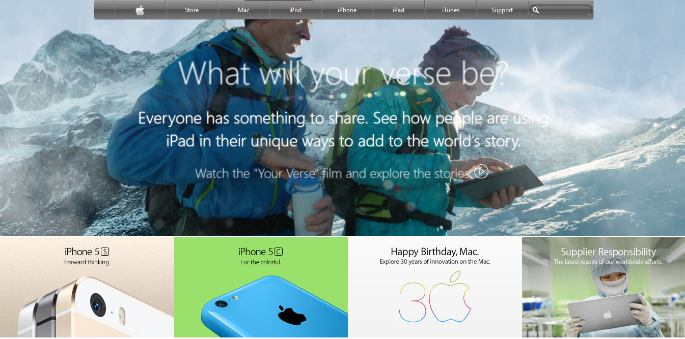

# A clone of the old apple.com website
Part of Microverse curriculum. A clone of the old apple.com webpage

This project consists of building an apple.com clone website of their archived site.

## Built With

- HTML
- CSS

## Live Demo

 [Live Demo Link](https://raw.githack.com/petersteph88/apple-clone/feature/index.html)

## Author

👤 **Peter Isiko**

- Github: [@Peter](https://github.com/petersteph88)

- Twitter: [@Peter](https://twitter.com/)

- Linkedin: [Peter](www.linkedin.com/in/peter-isiko-8040bb1a3/)

## 🤝 Contributing

Contributions, issues and feature requests are welcome!

Feel free to check the [issues page](issues/).

## Show your support

Give a ⭐️ if you like this project!

## Acknowledgments

- Thanks be to God.
- Thanks to my Family.
- Thanks to Microverse.